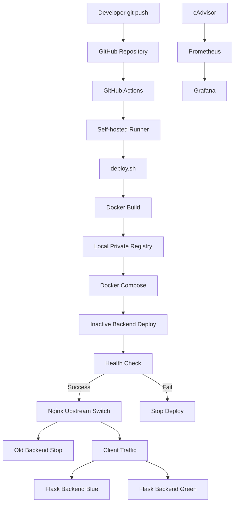

cat > README.md <<'EOF'
# Mini Deploy Pipeline

Docker Compose 기반 Blue-Green 배포 파이프라인 프로젝트입니다.

이 프로젝트는 단순 Bash 배포 스크립트에서 출발하여 Docker Compose, Nginx Reverse Proxy, Local Private Registry, GitHub Actions Self-hosted Runner, Prometheus/Grafana 모니터링까지 확장한 DevOps 학습 프로젝트입니다.

코드 변경 이후 이미지 빌드, Registry Push, Inactive Backend 배포, Health Check, Nginx Upstream 전환까지 자동화하는 흐름을 직접 구성했습니다.

---

## 1. 프로젝트 목적

이 프로젝트의 목적은 단순히 컨테이너를 실행하는 것이 아니라, 실제 운영 환경에서 사용되는 배포 흐름을 축소된 형태로 직접 구현해보는 것입니다.

주요 목표는 다음과 같습니다.

- Docker Compose 기반 2-Tier 구조 구성
- Nginx Reverse Proxy 기반 Blue-Green 트래픽 전환
- Health Check 기반 안전한 배포
- Local Private Registry를 통한 이미지 저장 및 버전 관리
- GitHub Actions Self-hosted Runner 기반 자동 배포
- Prometheus, cAdvisor, Grafana 기반 컨테이너 모니터링
- 장애 상황에서 서비스 상태를 확인하고 복구 흐름 검증

---

## 2. Architecture



---

## 3. 배포 구조

전체 배포 흐름은 다음과 같습니다.

```text
Developer
→ git push
→ GitHub Actions
→ Self-hosted Runner
→ deploy.sh
→ Docker image build
→ Local Registry push
→ Inactive backend slot recreate
→ Health Check
→ Nginx upstream switch
→ Old backend stop
```

Blue-Green 구조는 다음과 같이 동작합니다.

```text
현재 active = blue
→ target = green
→ green backend를 새 이미지로 재생성
→ green health check 성공
→ nginx upstream을 green으로 전환
→ blue backend stop
```

반대로 현재 active가 green이면 blue가 target이 됩니다.

---

## 4. Directory Structure

```text
.
├── backend/
│   ├── app.py
│   └── dockerfile
│
├── nginx/
│   ├── dockerfile
│   ├── default.conf
│   ├── upstream.blue
│   ├── upstream.green
│   └── upstream.conf
│
├── monitoring/
│   ├── docker-compose.yml
│   └── prometheus.yml
│
├── docs/
│   └── monitoring-test.md
│
├── .github/
│   └── workflows/
│       └── workflow.yml
│
├── docker-compose.yml
├── deploy.sh
├── health_check.sh
├── switch.sh
├── rollback.sh
├── .gitignore
└── README.md
```

---

## 5. 주요 구성 요소

### Backend

Flask 기반 간단한 Backend 서버입니다.

Blue와 Green 환경을 구분하기 위해 `APP_MESSAGE` 환경변수를 사용합니다.

```text
backend-blue
→ Flask Backend Blue

backend-green
→ Flask Backend Green
```

---

### Nginx Reverse Proxy

Nginx는 Client 요청을 현재 active backend로 전달합니다.

`upstream.conf` 심볼릭 링크를 `upstream.blue` 또는 `upstream.green`으로 변경하여 트래픽을 전환합니다.

```text
upstream.conf → upstream.blue
upstream.conf → upstream.green
```

전환은 `switch.sh`에서 수행합니다.

```bash
./switch.sh blue
./switch.sh green
```

---

### Local Private Registry

Local Registry는 배포 이미지 저장소 역할을 합니다.

```text
localhost:5000/mini-backend:<tag>
```

GitHub Actions에서 실행될 경우 `GITHUB_SHA` 기반 태그를 사용하여 어떤 커밋 기준으로 생성된 이미지인지 추적할 수 있습니다.

예시:

```text
localhost:5000/mini-backend:4ebdc31
```

로컬에서 직접 실행할 경우 날짜 기반 태그를 사용할 수 있습니다.

```text
localhost:5000/mini-backend:20260830-2052
```

---

### GitHub Actions Self-hosted Runner

GitHub Actions의 self-hosted runner를 사용하여 배포 대상 VM 내부에서 직접 배포 스크립트를 실행합니다.

```text
git push
→ GitHub Actions 실행
→ self-hosted runner 동작
→ deploy.sh 실행
→ Blue-Green 배포 수행
```

---

### Monitoring

Prometheus, cAdvisor, Grafana를 사용하여 Docker 컨테이너 상태를 모니터링합니다.

```text
cAdvisor
→ Docker 컨테이너 CPU / Memory / Network 메트릭 수집

Prometheus
→ cAdvisor 메트릭 scrape 및 저장

Grafana
→ Prometheus 데이터를 시각화
```

확인한 주요 메트릭은 다음과 같습니다.

```text
container_cpu_usage_seconds_total
container_memory_usage_bytes
container_network_receive_bytes_total
```

---

## 6. 주요 스크립트

### deploy.sh

전체 Blue-Green 배포를 수행하는 메인 스크립트입니다.

수행 흐름:

```text
1. 현재 nginx upstream 확인
2. active / target backend 결정
3. Docker image build
4. Local Registry push
5. target backend 재생성
6. health_check.sh 실행
7. switch.sh로 nginx upstream 전환
8. 기존 active backend stop
```

---

### health_check.sh

Blue 또는 Green backend 컨테이너가 healthy 상태인지 확인합니다.

```bash
./health_check.sh blue
./health_check.sh green
```

---

### switch.sh

Nginx upstream을 Blue 또는 Green으로 전환합니다.

```bash
./switch.sh blue
./switch.sh green
```

내부적으로 nginx 컨테이너 안에서 upstream symlink를 변경하고, nginx 설정 검증 후 reload를 수행합니다.

```text
ln -sfn upstream.blue upstream.conf
nginx -t
nginx -s reload
```

---

### rollback.sh

장애 상황에서 이전 backend로 수동 복구하기 위한 스크립트입니다.

현재 기본 자동 배포 흐름은 `deploy.sh`와 `switch.sh` 중심이며, `rollback.sh`는 수동 복구용으로 관리합니다.

---

## 7. 실행 방법

### 7.1 Local Registry 실행

```bash
docker run -d \
  --name local-registry \
  --restart unless-stopped \
  -p 5000:5000 \
  registry:2
```

Registry 상태 확인:

```bash
curl http://localhost:5000/v2/
```

정상 응답 예시:

```json
{}
```

---

### 7.2 수동 배포 실행

```bash
cd /root/deploy-test

./deploy.sh
```

서비스 확인:

```bash
curl localhost:8080
```

응답 예시:

```text
Flask Backend Blue
```

또는

```text
Flask Backend Green
```

현재 실행 중인 컨테이너 확인:

```bash
docker ps --format "table {{.Names}}\t{{.Image}}\t{{.Status}}\t{{.Ports}}"
```

Registry 태그 확인:

```bash
curl http://localhost:5000/v2/mini-backend/tags/list
```

---

### 7.3 특정 이미지로 Compose 실행

`docker-compose.yml`은 `BACKEND_IMAGE` 환경변수를 사용합니다.

```bash
BACKEND_IMAGE=localhost:5000/mini-backend:<tag> docker compose -p deploy-test up -d
```

`BACKEND_IMAGE` 없이 실행하면 기본값인 `mini-backend:latest`를 찾기 때문에 이미지가 없을 경우 pull 오류가 발생할 수 있습니다.

---

## 8. GitHub Actions 자동 배포

`test-bluegreen` 브랜치에 push하면 GitHub Actions가 실행됩니다.

```text
git push origin test-bluegreen
→ GitHub Actions 실행
→ self-hosted runner
→ deploy.sh
→ build / push / deploy / switch
```

Workflow 주요 단계:

```text
Checkout repository
→ Make scripts executable
→ Show current container
→ Run blue-green deploy
→ Verify service
→ Show container after deploy
```

자동 배포 성공 시 다음 항목을 확인할 수 있습니다.

```bash
curl localhost:8080

docker exec nginx-proxy readlink /etc/nginx/conf.d/upstream.conf

curl http://localhost:5000/v2/mini-backend/tags/list
```

---

## 9. Monitoring 실행

모니터링 스택은 `monitoring/` 디렉터리에서 실행합니다.

```bash
cd monitoring

docker compose up -d
```

접속 정보:

```text
Prometheus → http://<server-ip>:9090
Grafana    → http://<server-ip>:3000
cAdvisor   → http://<server-ip>:8081
```

Prometheus target:

```text
cadvisor:8080
```

Grafana에서는 Blue / Green backend와 nginx-proxy 컨테이너의 CPU, Memory, Network 사용량을 확인했습니다.

---

## 10. 장애 테스트

Active backend 컨테이너를 중지하여 장애 상황을 재현했습니다.

예시:

```bash
docker stop py-backend-green
curl localhost:8080
```

결과:

```text
nginx-proxy는 살아있지만
upstream 대상 backend가 중지되어 502 Bad Gateway 발생
```

복구:

```bash
./switch.sh blue
curl localhost:8080
```

확인한 내용:

```text
active backend 장애 발생
→ nginx upstream 대상 없음
→ 502 Bad Gateway 확인
→ switch.sh로 반대편 backend 전환
→ 서비스 복구 확인
→ Grafana에서 메트릭 변화 확인
```

자세한 테스트 기록은 `docs/monitoring-test.md`에 정리했습니다.

---

## 11. Troubleshooting

### 11.1 docker compose up 실행 시 pull access denied 발생

증상:

```text
pull access denied for mini-backend
```

원인:

```text
BACKEND_IMAGE 환경변수 없이 docker compose up 실행
→ 기본값 mini-backend:latest 사용
→ 로컬 이미지 없음
→ Docker Hub pull 시도
→ 실패
```

해결:

```bash
BACKEND_IMAGE=localhost:5000/mini-backend:<tag> docker compose -p deploy-test up -d
```

또는 배포 스크립트 사용:

```bash
./deploy.sh
```

---

### 11.2 docker run으로 nginx 실행 시 backend-blue를 찾지 못함

원인:

```text
backend-blue는 Docker Compose network 내부의 service DNS 이름입니다.

docker run으로 컨테이너를 단독 실행하면
Compose network와 service DNS를 사용할 수 없기 때문에
nginx가 backend-blue를 찾지 못할 수 있습니다.
```

정리:

```text
단일 컨테이너 테스트
→ docker run 가능

여러 컨테이너가 서비스명으로 통신하는 구조
→ docker compose 사용
```

---

### 11.3 GitHub Actions에서 날짜 태그가 아닌 hash 태그가 생성됨

원인:

```text
GitHub Actions 환경에서는 GITHUB_SHA 환경변수가 존재합니다.

deploy.sh에서 GITHUB_SHA를 이미지 태그로 사용하면
날짜가 아니라 commit hash 기반 이미지 태그가 생성됩니다.
```

장점:

```text
배포된 이미지가 어떤 Git commit 기준인지 추적 가능
```

---

## 12. 개선 과정

초기 버전에서는 Bash Script 기반으로 단일 컨테이너 배포, Health Check, Rollback 흐름을 구성했습니다.

이후 다음 순서로 프로젝트를 개선했습니다.

```text
Shell Script Deploy
→ Docker 기반 배포
→ Docker Compose 2-Tier 구조
→ Nginx Reverse Proxy
→ Blue-Green Deploy
→ Prometheus / cAdvisor / Grafana Monitoring
→ Local Private Registry
→ GitHub Actions Self-hosted Runner 자동 배포
```

초기 구조에서는 `run_all.sh`, `deploy.sh`, `health_check.sh`, `rollback.sh`를 통해 배포 파이프라인을 구성했으며, 현재는 `deploy.sh` 중심의 Blue-Green 자동 배포 구조로 개선했습니다.

---

## 13. 향후 개선 계획

앞으로 개선할 수 있는 항목은 다음과 같습니다.

- Kubernetes 기반 배포 구조로 확장
- Ansible을 활용한 서버 초기 설정 및 배포 자동화
- 운영 서버와 Build 서버 분리
- 외부 Private Registry 또는 Cloud Registry 연동
- 승인 기반 CD Job 구성
- Blue-Green 배포 실패 시 자동 Rollback 조건 추가
- Grafana Dashboard JSON export 관리
- Alertmanager 기반 알림 연동
- 운영/개발 환경 분리 구성

---

## 14. 정리

이 프로젝트를 통해 단순 Bash 배포 스크립트에서 시작하여 Docker Compose 기반 Blue-Green 배포 구조로 확장했습니다.

또한 Local Private Registry와 GitHub Actions Self-hosted Runner를 연동하여 이미지 빌드, 저장, 배포, Health Check, 트래픽 전환까지 자동화했습니다.

운영 관점에서는 Prometheus, cAdvisor, Grafana를 통해 컨테이너 상태를 관측하고, Active backend 장애 상황에서 Nginx upstream 전환을 통해 서비스를 복구하는 흐름을 검증했습니다.
EOF
