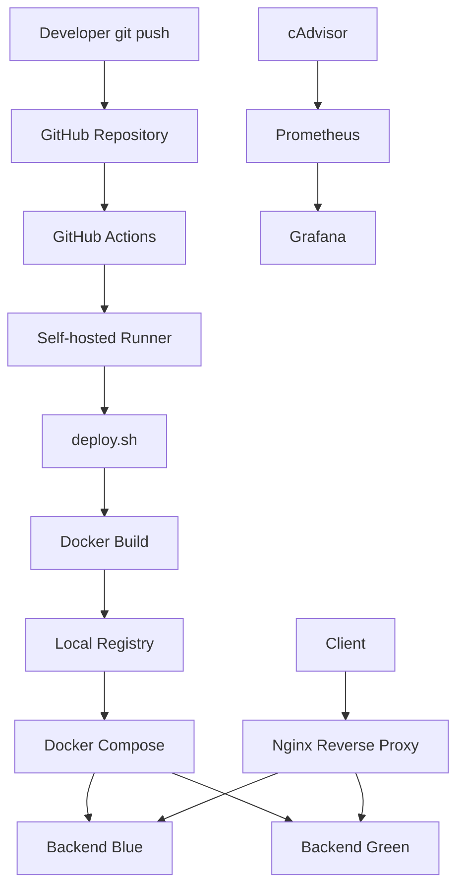

# Mini Deploy Pipeline

Docker Compose 기반 Blue-Green 배포와 GitHub Actions Self-hosted Runner를 활용한 컨테이너 배포 자동화 프로젝트입니다.

Flask Backend와 Nginx Reverse Proxy를 Blue-Green 구조로 구성하고, Local Private Registry와 GitHub Actions를 연동하여 다음 흐름을 자동화했습니다.

```text
git push
→ GitHub Actions
→ self-hosted runner
→ Docker image build
→ Local Registry push
→ inactive backend deploy
→ health check
→ nginx upstream switch
```

---

# Architecture



---

# Features

- Docker Compose 기반 Blue-Green 배포
- Nginx Reverse Proxy 기반 트래픽 전환
- Health Check 성공 시에만 active backend 변경
- Local Private Registry 기반 이미지 버전 관리
- GitHub Actions Self-hosted Runner 기반 자동 배포
- Prometheus / cAdvisor / Grafana 기반 컨테이너 모니터링
- Active backend 장애 상황 재현 및 복구 테스트

---

# Tech Stack

| Component | Description |
|---|---|
| OS | Rocky Linux |
| Backend | Flask |
| Proxy | Nginx |
| Container | Docker, Docker Compose |
| Registry | Local Private Registry |
| CI/CD | GitHub Actions, Self-hosted Runner |
| Monitoring | Prometheus, cAdvisor, Grafana |
| Script | Bash |

---

# Project Structure

```text
mini-deploy-pipeline
│
├── backend
│   ├── app.py
│   └── dockerfile
│
├── nginx
│   ├── dockerfile
│   ├── default.conf
│   ├── upstream.blue
│   ├── upstream.green
│   └── upstream.conf
│
├── monitoring
│   ├── docker-compose.yml
│   └── prometheus.yml
│
├── docs
│   └── monitoring-test.md
│
├── .github/workflows
│   └── workflow.yml
│
├── docker-compose.yml
├── deploy.sh
├── health_check.sh
├── switch.sh
├── rollback.sh
└── README.md
```

---

# Deployment Flow

배포는 `deploy.sh`를 통해 진행됩니다.

```text
1. 현재 active backend 확인
2. 반대편 inactive backend를 target으로 지정
3. Backend Docker image build
4. Local Registry에 image push
5. target backend 컨테이너 재생성
6. Health Check 수행
7. Nginx upstream 전환
8. 기존 active backend stop
```

예시:

```text
active = blue
target = green

green backend 배포
→ health check 성공
→ nginx upstream green 전환
→ blue backend stop
```

---

# GitHub Actions

`test-bluegreen` 브랜치에 push하면 GitHub Actions가 실행됩니다.

```text
Developer push
→ GitHub Actions
→ Self-hosted Runner
→ deploy.sh
→ Blue-Green Deploy
```

GitHub Actions 환경에서는 `GITHUB_SHA`를 이미지 태그로 사용하여 배포된 컨테이너가 어떤 커밋 기준인지 추적할 수 있습니다.

```text
localhost:5000/mini-backend:<commit-hash>
```

---

# Monitoring

Prometheus, cAdvisor, Grafana를 사용하여 컨테이너 상태를 모니터링했습니다.

```text
cAdvisor
→ Docker container metrics 수집

Prometheus
→ metrics 저장

Grafana
→ CPU / Memory / Network 시각화
```

확인한 주요 메트릭:

```text
container_cpu_usage_seconds_total
container_memory_usage_bytes
container_network_receive_bytes_total
```

---

# Failure Test

Active backend 컨테이너를 중지하여 장애 상황을 재현했습니다.

```text
active backend stop
→ nginx upstream 대상 없음
→ 502 Bad Gateway 발생
→ switch.sh로 반대편 backend 전환
→ 서비스 복구 확인
```

자세한 테스트 기록은 `docs/monitoring-test.md`에 정리했습니다.

---

# Troubleshooting

## docker compose up 실행 시 pull access denied

원인:

```text
BACKEND_IMAGE 환경변수 없이 docker compose up 실행
→ 기본값 mini-backend:latest 사용
→ 로컬 이미지 없음
→ Docker Hub pull 시도
→ 실패
```

해결:

```bash
BACKEND_IMAGE=localhost:5000/mini-backend:<tag> docker compose -p deploy-test up -d
```

## docker run으로 nginx 실행 시 backend-blue를 찾지 못함

원인:

```text
backend-blue는 Docker Compose network 내부의 service DNS 이름입니다.
docker run으로 단독 실행하면 Compose network와 service DNS를 사용할 수 없습니다.
```

정리:

```text
단일 컨테이너 테스트
→ docker run 가능

여러 컨테이너가 서비스명으로 통신하는 구조
→ docker compose 사용
```

---

# Improvement History

초기에는 Bash 기반 단일 컨테이너 배포 구조로 시작했습니다.

이후 다음 순서로 개선했습니다.

```text
Bash Deploy Script
→ Docker Build / Run
→ Docker Compose 2-Tier
→ Nginx Reverse Proxy
→ Blue-Green Deploy
→ Monitoring
→ Local Private Registry
→ GitHub Actions Self-hosted Runner 자동 배포
```

---

# Future Improvements

- Kubernetes 기반 배포 구조로 확장
- Ansible 기반 서버 설정 자동화
- Build 서버와 운영 서버 분리
- 외부 Private Registry 연동
- 승인 기반 CD Job 구성
- Blue-Green 실패 시 자동 Rollback 추가
- Alertmanager 기반 알림 연동

---

# Summary

이 프로젝트는 단순 Bash 배포 스크립트에서 시작하여 Docker Compose 기반 Blue-Green 배포 구조로 확장한 프로젝트입니다.

Local Registry와 GitHub Actions Self-hosted Runner를 연동하여 이미지 빌드, 저장, 배포, Health Check, 트래픽 전환까지 자동화했습니다.

또한 Prometheus, cAdvisor, Grafana를 통해 컨테이너 상태를 모니터링하고, backend 장애 상황에서 Nginx upstream 전환을 통한 복구 흐름을 검증했습니다.
