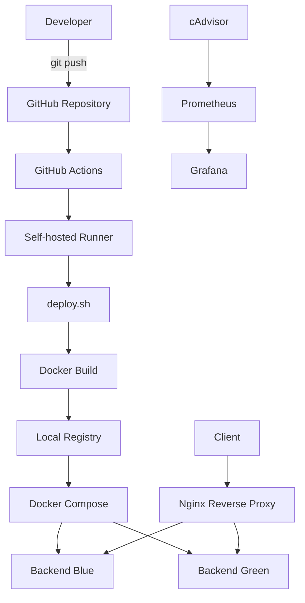

cat > README.md <<'EOF'
# Mini Deploy Pipeline

Docker Compose 기반 Blue-Green 배포와 GitHub Actions Self-hosted Runner를 활용한 컨테이너 배포 자동화 프로젝트입니다.

Flask Backend와 Nginx Reverse Proxy를 Blue-Green 구조로 구성하고, Local Private Registry에 이미지 버전을 저장한 뒤, GitHub Actions를 통해 `build → push → deploy → health check → traffic switch` 흐름을 자동화했습니다.

---

## Overview

이 프로젝트는 단순 Bash 기반 배포 스크립트에서 시작해, 실제 운영 환경에서 사용되는 배포 구조를 단계적으로 확장한 DevOps 학습 프로젝트입니다.

최종적으로 다음 흐름을 구현했습니다.

```text
Developer Push
→ GitHub Actions
→ Self-hosted Runner
→ Docker Image Build
→ Local Registry Push
→ Inactive Backend Deploy
→ Health Check
→ Nginx Upstream Switch
→ Old Backend Stop
```

---

## Architecture



---

## Tech Stack

| Category | Stack |
|---|---|
| OS | Rocky Linux |
| Container | Docker, Docker Compose |
| Web / Proxy | Nginx |
| Backend | Flask |
| CI/CD | GitHub Actions, Self-hosted Runner |
| Registry | Local Private Registry |
| Monitoring | Prometheus, cAdvisor, Grafana |
| Script | Bash |

---

## Key Features

- Docker Compose 기반 Blue-Green 배포 구조 구성
- Nginx Reverse Proxy를 통한 Blue / Green 트래픽 전환
- Health Check 성공 시에만 active backend 전환
- Local Private Registry를 통한 이미지 버전 관리
- GitHub Actions Self-hosted Runner 기반 자동 배포
- Prometheus / cAdvisor / Grafana 기반 컨테이너 모니터링
- Active backend 장애 상황 재현 및 복구 흐름 검증

---

## Project Structure

```text
.
├── backend/
│   ├── app.py
│   └── dockerfile
│
├── nginx/
│   ├── dockerfile
│   ├── default.conf
│   ├── upstream.blue
│   ├── upstream.green
│   └── upstream.conf
│
├── monitoring/
│   ├── docker-compose.yml
│   └── prometheus.yml
│
├── docs/
│   └── monitoring-test.md
│
├── .github/
│   └── workflows/
│       └── workflow.yml
│
├── docker-compose.yml
├── deploy.sh
├── health_check.sh
├── switch.sh
├── rollback.sh
└── README.md
```

---

## Deployment Flow

배포는 `deploy.sh`를 통해 수행됩니다.

```text
1. 현재 Nginx upstream 확인
2. active / target backend 결정
3. Backend Docker image build
4. Local Registry에 image push
5. Inactive backend slot 재생성
6. Health Check 수행
7. Nginx upstream 전환
8. 기존 active backend stop
```

예시:

```text
현재 active = blue
→ target = green
→ green backend 새 이미지로 재생성
→ green health check 성공
→ nginx upstream green 전환
→ blue backend stop
```

---

## CI/CD Flow

`test-bluegreen` 브랜치에 push하면 GitHub Actions가 실행됩니다.

```text
git push
→ GitHub Actions workflow 실행
→ Self-hosted Runner에서 deploy.sh 실행
→ Docker image build
→ Local Registry push
→ Blue-Green 배포
→ 서비스 검증
```

GitHub Actions 실행 시 이미지 태그는 `GITHUB_SHA` 기반으로 생성되어, 배포된 컨테이너가 어떤 커밋 기준인지 추적할 수 있습니다.

```text
localhost:5000/mini-backend:<git-commit-hash>
```

---

## Blue-Green Switching

Nginx는 `upstream.conf` 심볼릭 링크를 통해 Blue 또는 Green backend로 트래픽을 전달합니다.

```text
upstream.conf → upstream.blue
upstream.conf → upstream.green
```

전환은 `switch.sh`에서 수행합니다.

```bash
./switch.sh blue
./switch.sh green
```

전환 과정에서는 nginx 설정 검증 후 reload를 수행합니다.

```text
nginx -t
nginx -s reload
```

---

## Monitoring

모니터링은 `Prometheus + cAdvisor + Grafana` 구조로 구성했습니다.

```text
cAdvisor
→ Docker 컨테이너 메트릭 수집

Prometheus
→ cAdvisor 메트릭 scrape 및 저장

Grafana
→ CPU / Memory / Network 사용량 시각화
```

확인한 주요 메트릭:

```text
container_cpu_usage_seconds_total
container_memory_usage_bytes
container_network_receive_bytes_total
```

Active backend 장애 발생 시 Grafana에서 컨테이너 메트릭 변화와 중단 상태를 확인했습니다.

---

## Failure Test

Active backend 컨테이너를 중지하여 장애 상황을 재현했습니다.

```bash
docker stop py-backend-green
curl localhost:8080
```

확인 결과:

```text
nginx-proxy는 살아있지만
upstream 대상 backend가 중지되어 502 Bad Gateway 발생
```

복구는 반대편 backend로 upstream을 전환하여 수행했습니다.

```bash
./switch.sh blue
curl localhost:8080
```

테스트를 통해 다음 흐름을 검증했습니다.

```text
active backend 장애
→ 서비스 오류 발생
→ 반대편 backend 상태 확인
→ nginx upstream 전환
→ 서비스 복구
→ Grafana 메트릭 변화 확인
```

자세한 기록은 `docs/monitoring-test.md`에 정리했습니다.

---

## Troubleshooting

### 1. docker compose up 실행 시 pull access denied 발생

원인:

```text
BACKEND_IMAGE 환경변수 없이 docker compose up 실행
→ 기본값 mini-backend:latest 사용
→ 로컬 이미지 없음
→ Docker Hub pull 시도
→ pull access denied 발생
```

해결:

```bash
BACKEND_IMAGE=localhost:5000/mini-backend:<tag> docker compose -p deploy-test up -d
```

또는 배포 스크립트를 사용합니다.

```bash
./deploy.sh
```

---

### 2. docker run으로 nginx 실행 시 backend-blue를 찾지 못함

원인:

```text
backend-blue는 Docker Compose network 내부의 service DNS 이름입니다.
docker run으로 컨테이너를 단독 실행하면 Compose network와 service DNS를 사용할 수 없습니다.
```

정리:

```text
단일 컨테이너 테스트
→ docker run 가능

여러 컨테이너가 서비스명으로 통신하는 구조
→ docker compose 사용
```

---

## What I Learned

- 컨테이너 간 통신에서 Docker Compose network와 service DNS의 역할
- Blue-Green 배포에서 active / inactive slot을 분리하는 방식
- Health Check 이후 트래픽을 전환해야 하는 이유
- Registry를 통해 이미지 버전과 배포 단위를 분리하는 방식
- GitHub Actions Self-hosted Runner가 배포 서버에서 동작하는 구조
- 모니터링 도구를 통해 컨테이너 장애와 복구 흐름을 관측하는 방법

---

## Improvement History

초기에는 Bash 기반 단일 컨테이너 배포 구조로 시작했습니다.

이후 다음 순서로 개선했습니다.

```text
Bash Deploy Script
→ Docker Build / Run
→ Docker Compose 2-Tier
→ Nginx Reverse Proxy
→ Blue-Green Deploy
→ Prometheus / Grafana Monitoring
→ Local Private Registry
→ GitHub Actions Self-hosted Runner 자동 배포
```

---

## Next Steps

- Kubernetes 기반 배포 구조로 확장
- Ansible을 활용한 서버 초기 설정 자동화
- Build 서버와 운영 서버 분리
- 외부 Private Registry 또는 Cloud Registry 연동
- 승인 기반 CD Job 구성
- Blue-Green 배포 실패 시 자동 rollback 추가
- Grafana Dashboard JSON export 관리
- Alertmanager 기반 알림 연동

---

## Summary

이 프로젝트는 단순 배포 스크립트에서 시작하여 Docker Compose 기반 Blue-Green 배포 구조로 확장한 프로젝트입니다.

Local Registry와 GitHub Actions Self-hosted Runner를 연동하여 이미지 빌드, 저장, 배포, Health Check, 트래픽 전환까지 자동화했습니다.

또한 Prometheus, cAdvisor, Grafana를 통해 컨테이너 상태를 모니터링하고, Active backend 장애 상황에서 Nginx upstream 전환을 통한 복구 흐름을 검증했습니다.
